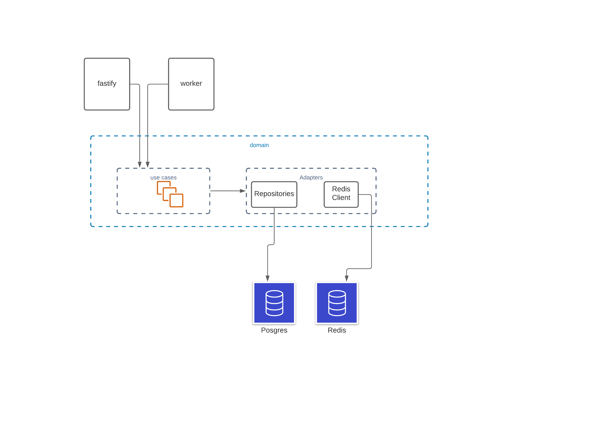

### What I built

Below are architectural the app.

This is a variation of clean code/hexagonal architecture.
There are two ways to schedule notification:
- Http: By making http request to endpoints (see api documentation)
- Publishing events: ssh into the app container `docker exec -it <containerId> /bin/bash` and run `yarn publish-event`

---

#### API Documentation
[doc](https://documenter.getpostman.com/view/263074/Tz5qbdYC)

### Running the app

- Create a `.env` in the base directory, docker compose and the app depends on a `.env` existing.
- The following with suitable values needs to be put inside the created `.env` file:

`REDIS_URL==redis://redis:6379`

`TEST_DB_PASSWORD=`

`TEST_DB_USER=`

`TEST_DB_NAME=`

`PROCESS_TYPE=`

`DB_PASSWORD=`

`DB_DIALECT=`

`PORT=5000`

`NODE_ENV=`

`DB_NAME=`

`DB_HOST=`

`DB_USER=`

---

### Future Improvements

- More test coverage.
- Fine grain user filtering.

---

### Thanks for the Fun!